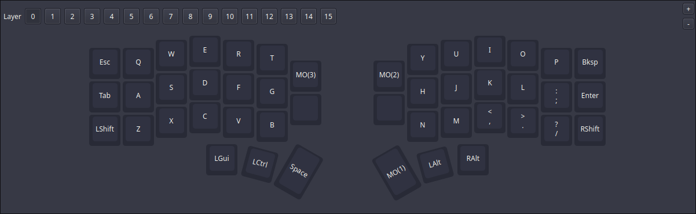
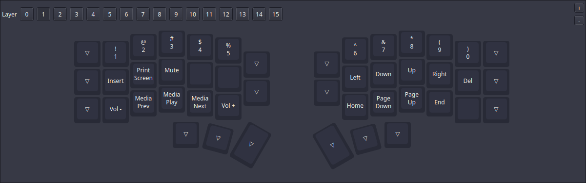
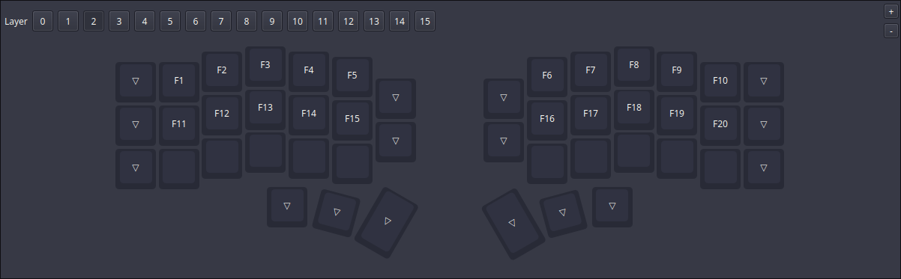
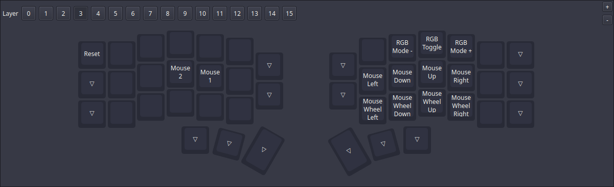

# ⌨️ crkbd

VIAL config for my Corne (foostan/crkbd) RGB keyboard. 
The keyboard config is in [keymap.vil](./keymap.vil).

## Keyboard Specs

These are the specs for my keyboard:
- Keyboard: [Corne (foostan/crkbd)](https://github.com/foostan/crkbd) (v4.1)
- Firmware: [VIAL](https://get.vial.today/) ([QMK](https://github.com/qmk/qmk_firmware) fork)
- Vendor: [Keebart](https://www.keebart.com/) ([keyboard reference](https://www.keebart.com/products/corne))
- RGB Lighting: yes
- QMK keyboard id: `crkbd/rev4_1`

## Layout

**Default Layer:** Letters and common symbols

**Layer 1 (NavNum):** Numbers, navigation keys and media keys

**Layer 2:** Function Keys (F1 - F20)

**Layer 3:** Mouse actions and RGB control

These screenshots were taken directly from the VIAL desktop application: https://get.vial.today/download/

> [!NOTE]
> Regarding my "OS keyboard layout", I have recently moved over from QWERTY to [Ergo-L](https://ergol.org/).
> Ergo-L is an ergonomic keyboard layout optimized for typing in French, English and with easy to access programming symbols.
> It's a really cool project and it fits perfectly with my use case. It's worth checking out.

## Images

*Coming soon...*
